# SamplePods

Are you tired of managing lots of repositories? Why so many huge companies are migrating to a single repository? Is it possible to have a single repository and still keep your frameworks organized and independent?

So, trying to answer that and several other related questions I have created this sample project to show you one of the many options to achieve a great result to keep all your frameworks in a single repository and still have them all working independently.

Understanding the sample project’s architecture:

As you can see, the goal is to create a single repository containing several independent frameworks. Some of the frameworks, such as Features and Tools we will be able to choose which specific feature or tool we would like to install in our app, not having to install all of them.

Let’s start creating a brand new framework on Xcode:

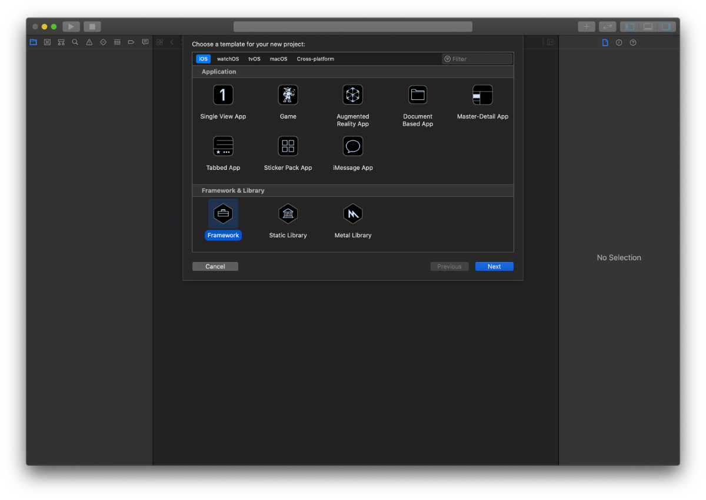

And choosing a super-duper amazing name to your project’s framework:

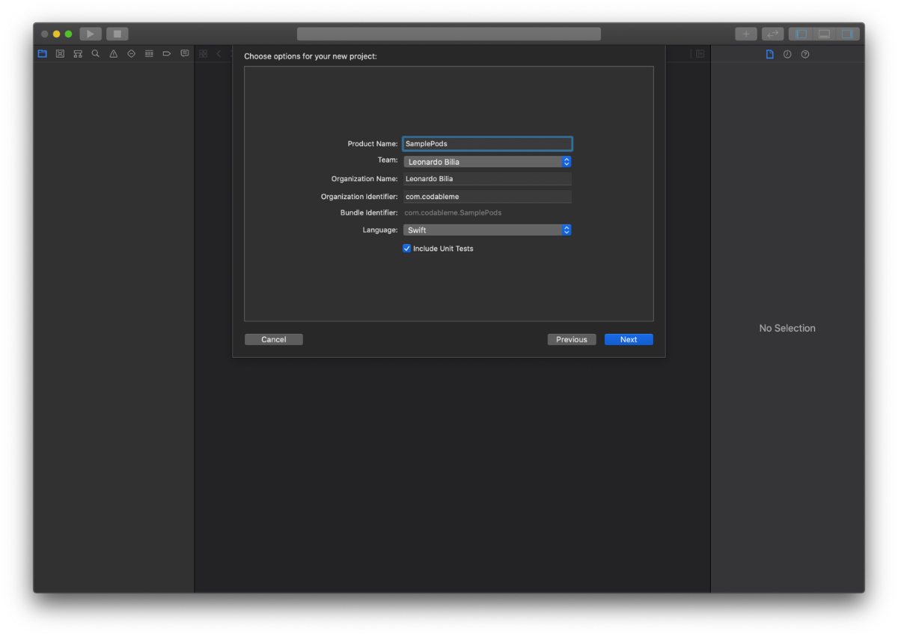

Then, you will need to create all the framework targets and folders to match your architecture.

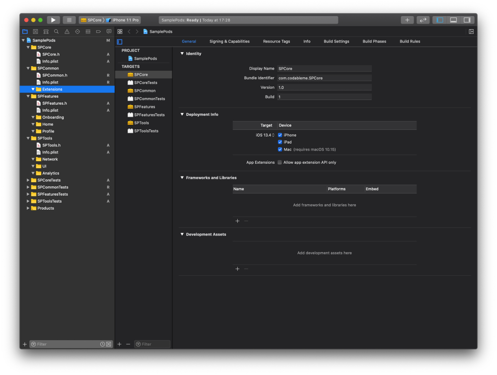

I recommend creating a simple class for each of your frameworks. So, you will be able to test it before putting a lot of effort into each of the sections of your project.

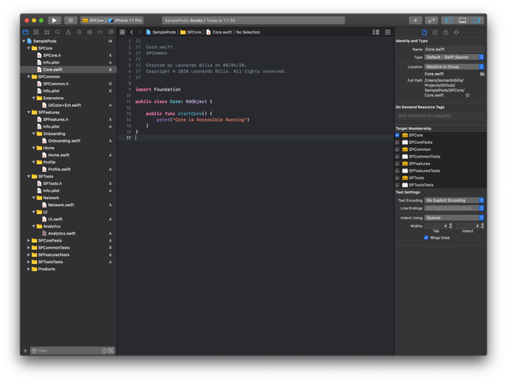

Now we are ready to create our GitHub repository and push our project. If you haven't done that yet, of course.

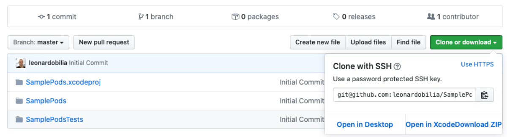

Ok, it’s time to create all the needed pod specs to be able to install your frameworks independently. Be sure to create the pod specs following the same name you have chosen for your frameworks.

You can create all the pod specs on Terminal, by navigating to your project’s root folder and typing:

    touch FRAMEWORK-NAME.podspec

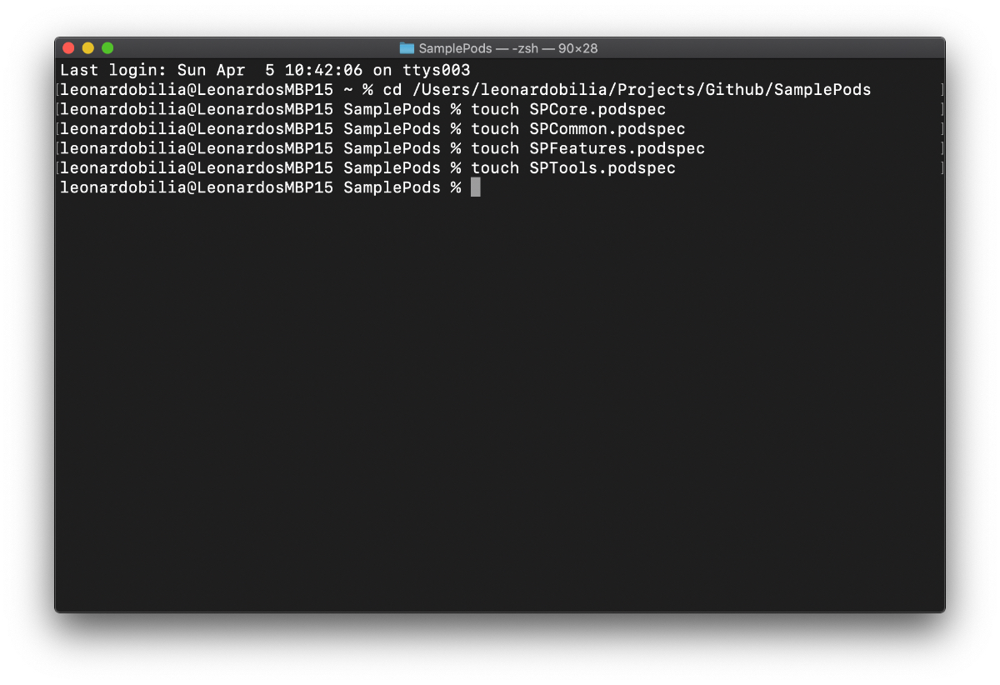

Next, let’s add some work into the pod spec files.

Be sure to create a unique tag for each of the frameworks. 
In this example I have defined the following pattern:

    FRAMEWORK_NAME-FRAMEWORK_VERSION

It would be something like:

    SPCore-0.0.1

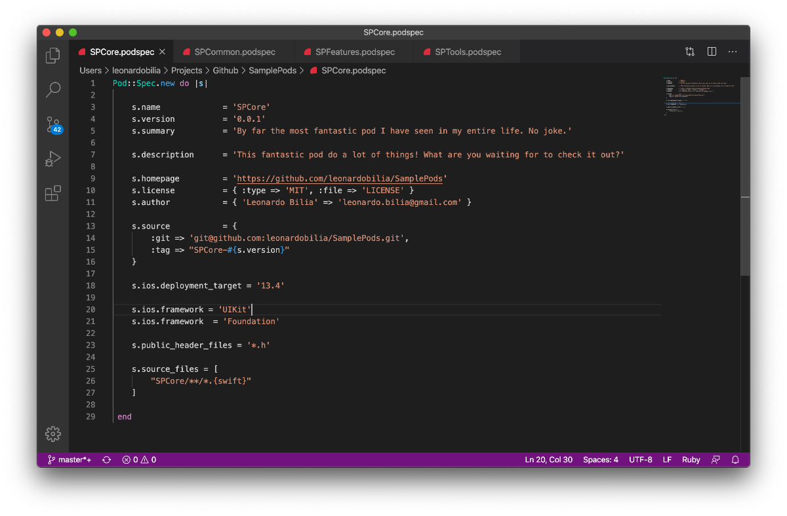

For the frameworks such as Features and Tools where we would like to have the ability to install a single feature instead of the entire framework, we are going to use sub specs to get the job done.

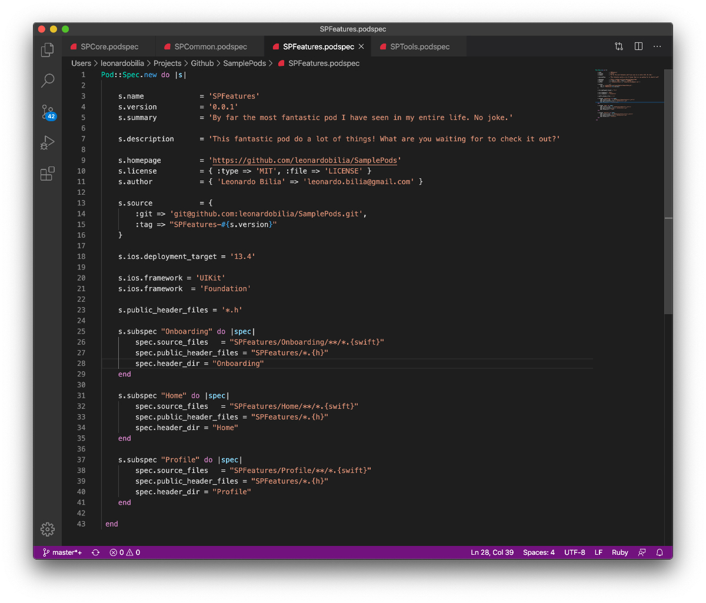

Let’s save and push everything to GitHub!

**Don't give up! We’re almost done.**

Now, let’s tag our frameworks respecting the rules and the version we have used to define our pod specs. Don’t forget to push the new tags to GitHub, right!

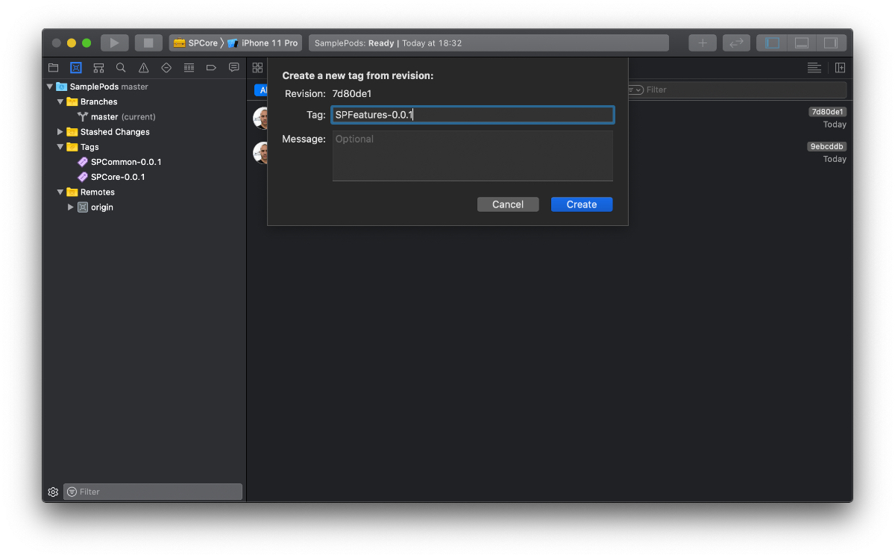

Ok, now we can test our framework! Let’s do it together.

Start a brand new Xcode project and pic the single view application option. Give it a name of choice and save it somewhere to your computer.

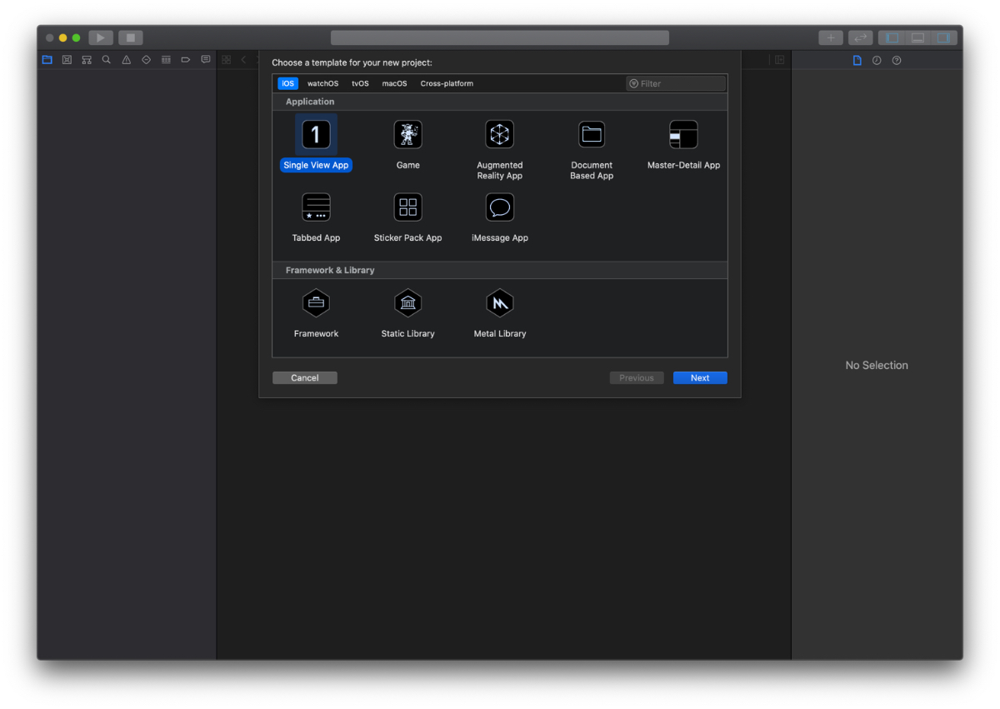

Quit Xcode and navigate to the root folder of your new project on Terminal. When you are there just type:

    Pod init

To create a pod file in the root folder.

Now, let’s open the Podfile and add the frameworks we would like to install. But, since the project isn’t available on CocoaPods at this point, we are going to point it directly to our git repository and to the related tag.

    pod 'SPCore', :git => 'git@github.com:leonardobilia/SamplePods.git', :tag => 'SPCore-0.0.1'

And to install a single feature for example, you can use:

    pod 'SPFeatures/Profile', :git => 'git@github.com:leonardobilia/SamplePods.git', :tag => 'SPFeatures-0.0.1'

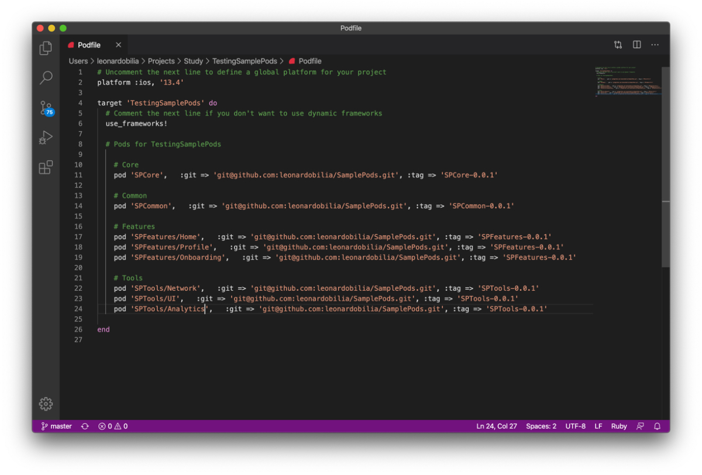

Now, back to Terminal, just type:  

    Pod install

Open the new **.xcworkspace** on Xcode and you can go to the **ViewController.swift** file to import and test your frameworks:

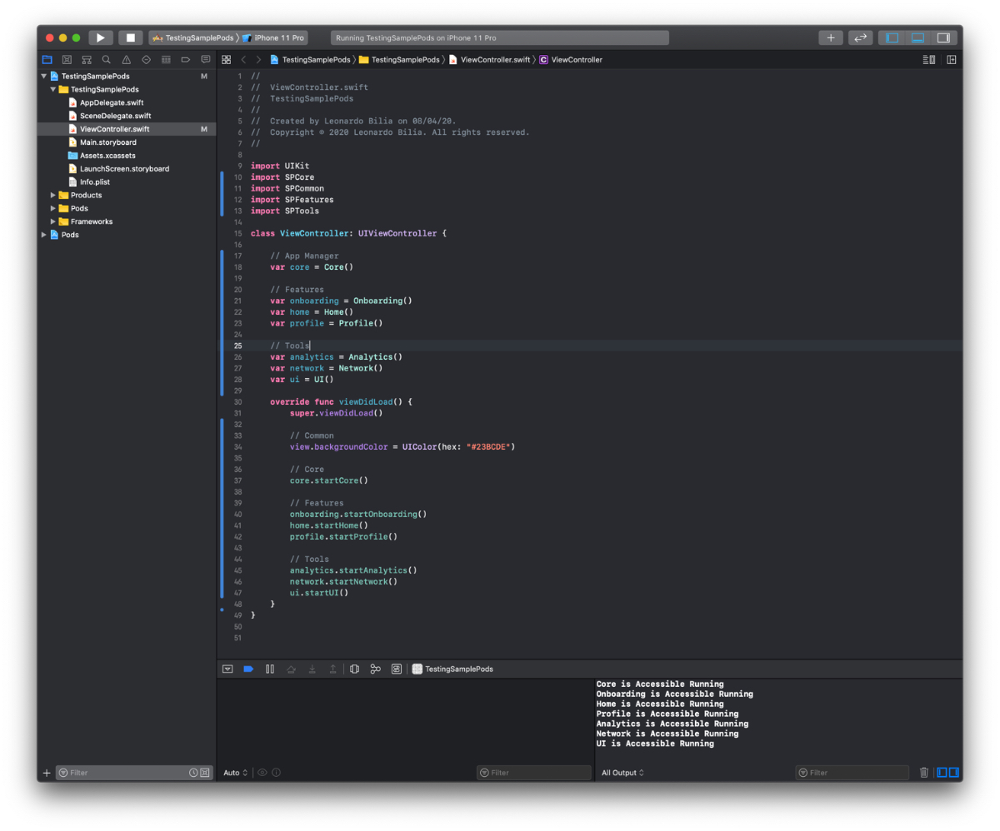

That’s it. 
I hope it can help you create and manage your own single repository for all your great frameworks.
